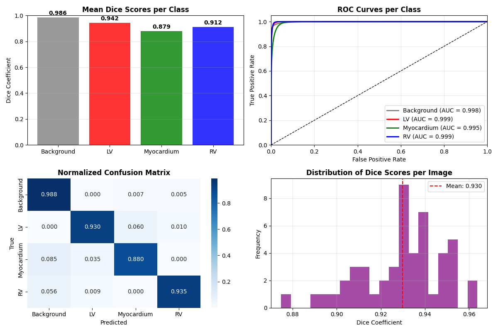
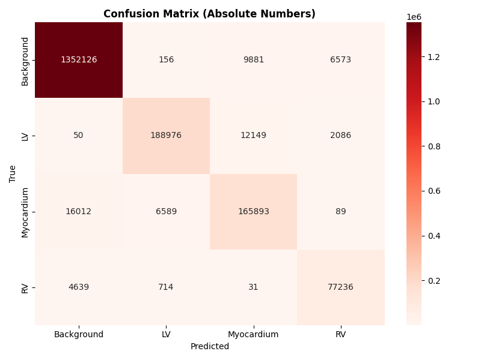

# CAMUS-HeartNet: Deep U-Net Ensemble with Meta-Learning for Cardiac MRI Segmentation

A research-oriented deep learning framework for multi-class cardiac MRI segmentation on the CAMUS dataset using U-Net ensembles and meta-learning-based fusion.

##  Publication

**Title:** CAMUS-HeartNet: A Deep Meta-Ensemble Architecture for Accurate Cardiac Tissue Segmentation  
**Preprint Server:** medRxiv  
**DOI:** https://doi.org/10.1101/2025.10.17.25338213  
**Publication Date:** October 19, 2025  
**URL:** https://www.medrxiv.org/content/10.1101/2025.10.17.25338213v1


##  Project Overview
### Intended Audience

This repository is intended for:
- Medical imaging researchers working with cardiac MRI
- Deep learning practitioners in biomedical segmentation
- Researchers using the CAMUS dataset
- Graduate students and PhD candidates in medical image analysis

This project implements an advanced cardiac segmentation system that combines multiple Deep U-Net models with meta-learning techniques to achieve state-of-the-art performance in segmenting cardiac structures from MRI images. The system accurately segments four cardiac regions: Background, Left Ventricle (LV), Myocardium, and Right Ventricle (RV).

##  Key Features

- **Deep U-Net Ensemble**: Multiple U-Net models with enhanced depth and architecture
- **Meta-Learning Integration**: Learnable ensemble fusion strategy for combining multiple U-Net predictions
- **Advanced Data Pipeline**: Comprehensive preprocessing and augmentation
- **Medical-Grade Evaluation**: Clinical metrics including Dice scores and ROC analysis
- **High Performance**: Achieves >96% accuracy and >92% mean Dice score

##  Performance Results


### Quantitative Evaluation (50 Test Samples)
- **Overall Accuracy**: 96.80%
- **Global Mean Dice**: 92.98%
- **Per-Image Mean Dice**: 92.98%

### Class-wise Segmentation Performance
| Class | Dice Score | AUC Score |
|-------|------------|-----------|
| Background | 98.61% | 99.82% |
| Left Ventricle (LV) | 94.24% | 99.89% |
| Myocardium | 87.92% | 99.48% |
| Right Ventricle (RV) | 91.15% | 99.89% |

##  Installation

### Prerequisites
- Python 3.8+
- TensorFlow 2.10+
- CUDA-compatible GPU (recommended)

### Required Packages
```bash
pip install tensorflow==2.10.0
pip install opencv-python
pip install scikit-learn
pip install scikit-image
pip install matplotlib
pip install seaborn
pip install pandas
pip install numpy
pip install joblib
```


### Data Setup
1. Download the CAMUS dataset
2. Place HDF5 files in the appropriate directory
3. Update data paths in the configuration

## 🚀 Usage

### Training New Models
```python
from cardiac_segmentation import main_training

main_training()
```

# Train new ensemble models
main_training()


### Evaluating Pre-trained Models
```python
from cardiac_segmentation import main_evaluation

main_evaluation()
```

# Evaluate existing models
main_evaluation()


### Custom Usage
```python
from cardiac_segmentation import DeepCardiacEnsembleMeta, CardiacModelEvaluator

ensemble = DeepCardiacEnsembleMeta(
    input_shape=(192, 192, 1),
    num_classes=4
)
ensemble.build_models()

ensemble.train_models(train_dataset, val_dataset)
results = ensemble.evaluate_ensemble(test_dataset)
```


##  Architecture

### Core Components

1. **Deep U-Net Models**
   - Enhanced U-Net architecture with additional layers
   - Batch normalization and dropout for regularization
   - Skip connections for improved gradient flow

2. **Ensemble System**
   - Multiple U-Net variants (v1, v2)
   - Weighted prediction combination
   - Meta-learning for intelligent fusion

3. **Data Pipeline**
   - Image resizing and normalization
   - Anatomical structure-preserving augmentation
   - Batch processing with TensorFlow Dataset API

4.**Evaluation Framework**
   - Dice coefficient calculation
   - ROC curve analysis
   - Confusion matrices
   - Per-class performance metrics

##  Project Structure


cardiac_segmentation/
├── cardiac_segmentation.py      # Main implementation
└── README.md                   # This file


##  Configuration

Key configuration parameters in the code:
- `input_shape = (192, 192, 1)` - Input image dimensions
- `num_classes = 4` - Number of segmentation classes
- `batch_size = 8` - Training batch size
- `epochs = 150` - Training epochs
- `learning_rate = 1e-3` - Initial learning rate

##  Results Visualization

The system generates comprehensive visualizations:
- Dice scores per class
- ROC curves for each cardiac structure
- Confusion matrices
- Distribution of segmentation performance
- Training history plots

##  Clinical Applications

- Cardiac function analysis
- Ventricular volume measurement
- Myocardial mass calculation
- Treatment planning and monitoring
- Cardiovascular disease research
> ⚠️ **Research Use Only**  
> This software is intended for research purposes and must not be used for clinical decision-making without proper regulatory approval and expert validation.

##  Contributing

1. Fork the repository
2. Create a feature branch
3. Commit your changes
4. Push to the branch
5. Create a Pull Request

### 📝 Citation
If you use this work in your research, please cite our paper:

**Rahi, A. (2025). CAMUS-HeartNet: A Deep Meta-Ensemble Architecture for Accurate Cardiac Tissue Segmentation. medRxiv. https://doi.org/10.1101/2025.10.17.25338213**

If you use the model or code in your work, please also cite:

**Rahi, A. (2025). CAMUS-HeartNet: Implementation of Deep Meta-Ensemble Architecture for Cardiac Tissue Segmentation [Computer model]. GitHub. https://github.com/AlirezaRahi/CAMUS-HeartNet-A-Deep-Meta-Ensemble-Architecture-for-Accurate-Cardiac-Tissue-Segmentation**

## 📄 License

This project is licensed under the Creative Commons Attribution-NonCommercial-NoDerivatives 4.0 International License.


##  Contact

**Alireza Rahi**
- Email: alireza.rahi@outlook.com
- LinkedIn: [Alireza Rahi](https://www.linkedin.com/in/alireza-rahi-6938b4154/)
- GitHub: [AlirezaRahi](https://github.com/AlirezaRahi)

##  Acknowledgments

- CAMUS dataset providers
- TensorFlow and scikit-learn communities
- Medical imaging research community

---

**Copyright (c) 2025 Alireza Rahi**  
*For licensing and commercial use inquiries, please contact the author.*
